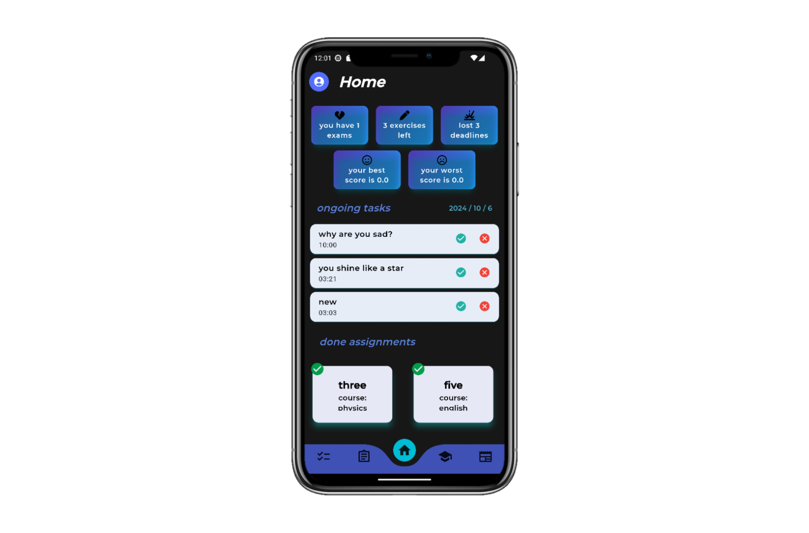
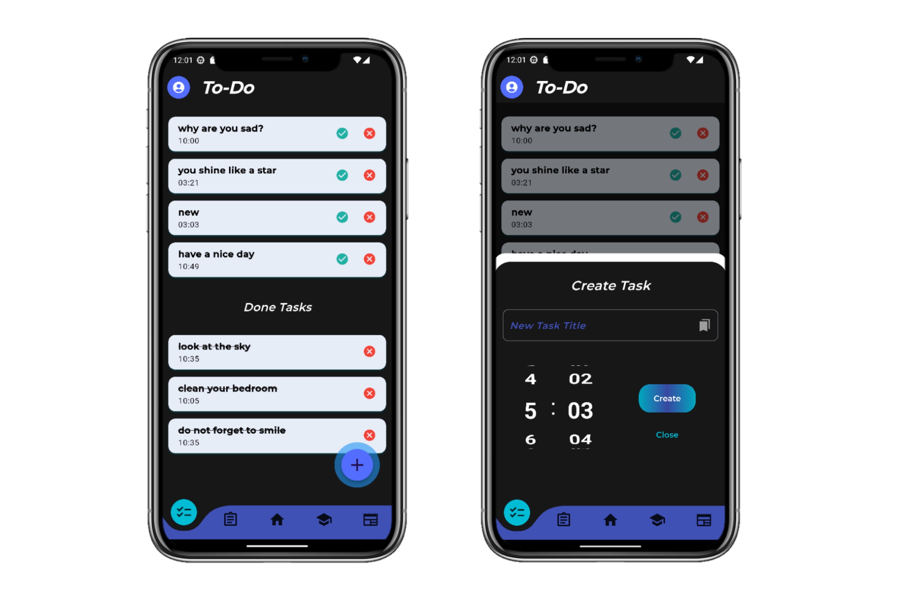
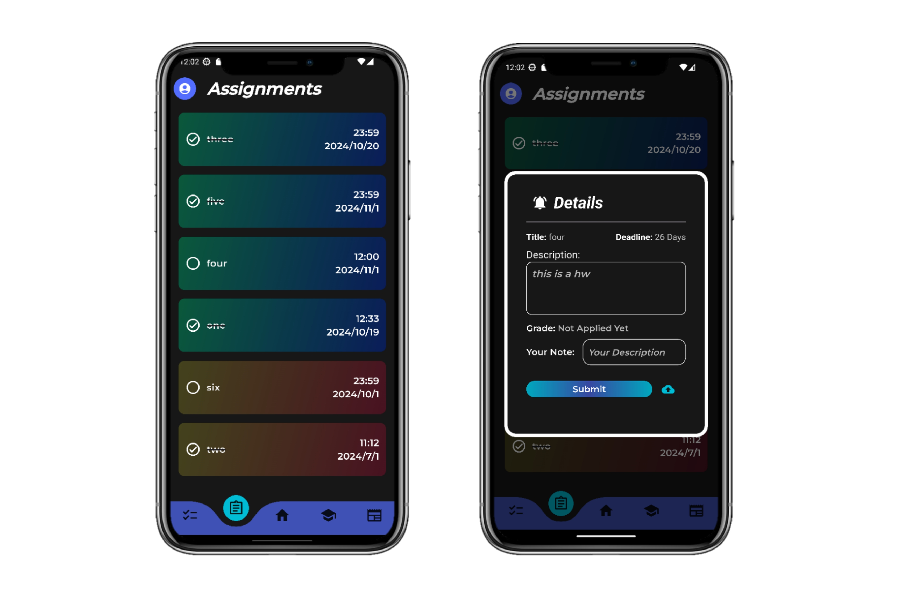
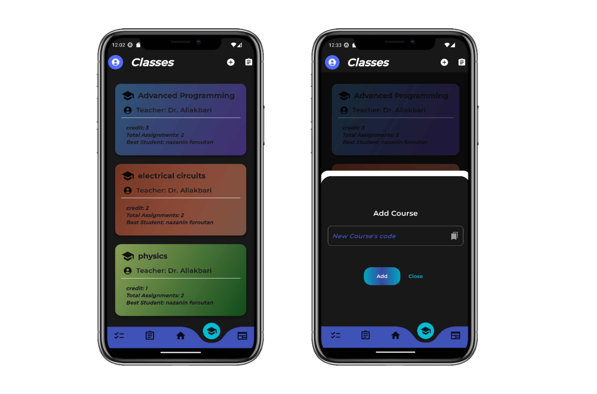

# Unisphere: Student Task Manager

This is a Task Manager designed specifically for students to help manage their assignments, classes, and tasks effectively. The project is currently under active development and is not yet complete. Below is an outline of the current progress and planned features.

## Project Status: Work In Progress!!
This project is currently under active development, and many features are not yet fully implemented. I'm working on improving it and adding new functionality. Stay tuned for updates!

## Overview And Features

### Welcome: 
- Navigation through login and sign-up screen

### Login and Signup:
-  User authentication

### Home:
- The main screen that contains the summary of tasks

### Todo List:
- A time-based todo list that let you add, remove your tasks and make them done

### Assignments:
- To manage the assignments and see their details

### Classes:
- Include class info with the ability of adding class

### News:
- To see the tag-bases news

### Profile:

- Let you see your info, log out and change your password

## CLUI and backend:

There are several files including database, data, server and etc put in backend including the command line user interface specifically for admin to be able to have access to the .txt database...

- This was a quick review over backend because it is not finished yet...

### ** This was my project for Advanced Programming class

## 🚀 About Me
- [@nforoutann](https://github.com/nforoutann)
I'm a Computer Engineering (Computer Science) student at Shahid Beheshti University, passionate about technology, a lifelong learner, and professional nerd.

